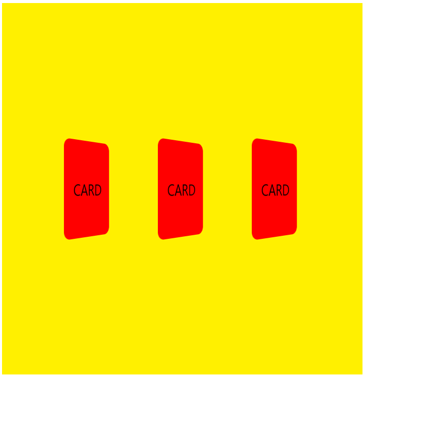

# CSS 3D

## 1. 원근감 주기

- `perspective: 500px;` : 내 눈에서 500px 떨어진 거리에서 보이는 느낌이다.
- `transform: perspective(500px) rotateY(45deg);` : 만약 여러 요소들이 똑같은 느낌의 원근감을 적용시키고 싶다면 transform 안에서 perspective를 사용한다.
  

## 2. 뒤집기 효과

```text
word (호버 시 뒤집기)
ㄴ card (중간 div 컨테이너)
  ㄴ card-side (앞과 뒷 화면의 공통 속성)
    ㄴ card-side-front
    ㄴ card-side-back
```

- card에 relative를 적용하고, card-side에 absolute를 적용해서 card 공간 내부에 카드 위치를 고정시킨다.
- card > card에 3D 속성이 전달되지 않을 수 있으므로, `transform-style: preserve-3d;`를 사용한다.
- card-side > 뒤집혔을 때 원래 앞면은 보이지 않도록 `backface-visibility: hidden;`를 설정한다.
- card-side-front > 앞면이 위로 먼저 보이게 `z-index: 1` 로 설정한다.
- card-side-back > 뒷면의 내용물 부분이 뒤집혔을 때 보이도록 `transform: rotateY(180deg);`로 180도 Y축으로 회전시킨다.

## 3. 다양한 브라우저에서 생기는 문제 해결하기

- 사파리는 backface-visibility지원이 느리다. webkit 기반으로 만들어져서 이를 빠르게 적용되도록해주어야 한다.
  - `-webkit-backface-visibility: hidden;`
- 인터넷 익스플로러는 preserve-3d 가 지원이 안되고, perspective는 바로 아랫단계까지만 지원된다.
  - card 컨테이너로 감싸서 한꺼번에 돌리지 않고, 각각 별개로 앞면과 뒷면을 돌려야 한다.
  - 앞면 : 0 -> 180도
  - 뒷면 : 180 -> 360도
